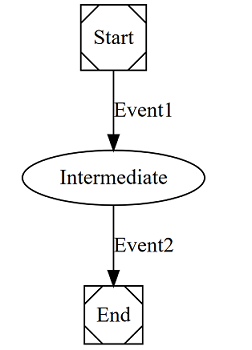

## What is WorkflowState ?

Simple workflow management 


## Package & Status

Package  | Build status | NuGet 
-------- | ------------ | ------------ 
WorkflowState.Core |  | [](https://www.nuget.org/packages/WorkflowState.Core/)


## How do I get started?

### Install the package

```
Install-Package WorkflowState.Core
```

### Configure your workflow 

```csharp
workflow.Configure(conf =>
{
    conf.CreateTransition(startState, endState, trigger);
});
```

### Use it 

```csharp
var stateInformation = workflow.GetNextState(startState, trigger);
```

### Exporting your workflow 

```csharp
var graph = GraphHelper.ExportWorkflow(workflow);
```

### Visualize your workflow on site who draw dot graph like https://dreampuf.github.io/GraphvizOnline/



## Contributing

A good way to get started (flow)

1. Fork the WorkflowState repos.
1. Create a new branch in you current repos from the 'master' branch.
1. 'Check out' the code with Git
1. Check [contributing.md](CONTRIBUTING.md)
1. push commits and create a Pull Request (PR) to WorkflowState

## License

This project is licensed under the MIT License - see the [LICENSE.md](LICENSE.md) file for details